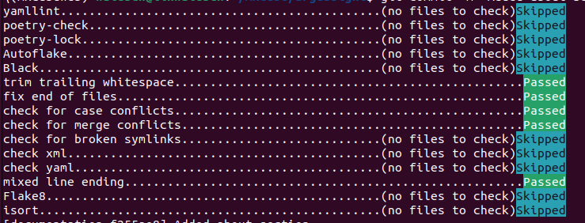

# Contributing to Argussight

Thank you for considering contributing to [Argussight](https://github.com/walesch-yan/argussight)! Contributions are what make the open-source community such an amazing place to learn, inspire, and create. Before diving into your first contribution, please read our guidelines. They aim at helping the community to maintain a stable and reusable code.

## Reporting Issues

If you encounter a bug or have a question, do not hesitate to:

- Check the [issues](https://github.com/walesch-yan/argussight/issues) to see if it has already been reported.
- Create a [new issue](https://github.com/walesch-yan/argussight/issues/new) with a clear and descriptive title and include:
    - Steps to reproduce
    - Expected vs actual results
    - Any relevant screenshots or logs

---

## Feature Requests

We welcome feature requests! Please submit them via [new issue](https://github.com/walesch-yan/argussight/issues/new) and provide as much detail as possible.

---

## Submitting Pull Requests

Pull requests (PRs) are used to submit new code to the repository; they help developers review and discuss the proposed changes. To avoid any conflicts in the code base, it is important to keep your local git repository synchronised with the latest code in the upstream repository. If the repository is checked out directly, then use `git pull --rebase` to obtain the latest code; if a fork is used, then add the official argussight repository to the list of remotes.

PRs should be made against the [master](https://github.com/walesch-yan/argussight/tree/master) branch. Herefore, you should create a new branch and make a PR according to the description below

### Preparing a new commit
1. Make sure that you are working with the latest changes from the master branch. From the root of the repository do:

        git checkout master
        git pull --rebase master

1. Create a new branch. It is recommended to use a meaningful name, for instance:

        git checkout -b [initials]-[fix/feature]-[some name]

    For the remainder of this page, we assume that your branch is called `mx-fix-documentation`.

1. Make your changes through editing, deleting and adding files.
1. Test your changes and make sure, the code behaves as expected.
1. Use [our pre-commit hooks](#pre-commit-hooks) for code formatting and linting.
1. Commit your changes and push the branch

        git add .
        git commit -m "Add feature X"
        git push origin mx-fix-doumentation

### Create a new PR on the Github webpage
After committing and pushing your changes to the remote repository, the final step is to create a pull request (PR) for review and merging into the `master` branch. To do so, you can navigate to your branch on the github webpage and create a new pull request. Below you can find some general guidelines for your PR:

- Keep pull requests focused; ideally, they should address only a single feature or change.
- Provide a clear and detailed summary in the pull request description to help reviewers easily understand the changes.
- Highlight technically complex sections of code and provide inline comments to explain or justify areas that may require additional clarification.
- Reference any related issue to connect your PR to the broader context.
- *Optional*: Mark your PR as draft, if it is still a work in progress.

### Pull Request Checklist

- Your code follows the [style guide](#style-guidelines)
- Documentation is updated if needed
- The PR description is clear and complex code sections are commented

---

## Style Guidelines

- UK English should be used for the spelling in documentation and code.
- The use of type hints is strongly encouraged.
- Use a maximum of 88 characters per line.
- Use 4 spaces per indentation level.
- Do not use wild (star) imports.
- When catching exceptions, mention specific exceptions whenever possible instead of using a bare except.
- Used naming styles:
    - lower_case_with_underscores (snake style) for variables, methods.
    - CapitalizedWords for class names.
    - UPPERCASE for constants.

---

## Pre-Commit Hooks

We use [pre-commit](https://pre-commit.com/) to ensure code quality and consistency across contributions. Pre-commit hooks are a set of scripts that run automatically before you make a commit, checking your code for formatting, linting, and other issues. This helps catch problems early, ensuring that all commits meet the project's standards.

### Setting Up Pre-Commit
1. Install `pre-commit` (if you haven't already):

        ```
            pip install pre-commit
        ```

1. Install the hooks defined in our `.pre-commit-cnfig.yaml` file:

        ```
            pre-commit install
        ```

1. Once installed, the hooks will run automatically on every commit. If a hook detects an issue, it will either fix it or prevent the commit until the issue is resolved (Either way, you need to redo the `git add`/`git commit` part). Your commits will then look like this:

    

1. To run the hooks manually (optional):

        ```
            pre-commit run --all-files
        ```

### What Do the Hooks Check?

For a full list, checkout the `.pre-commit-cnfig.yaml` file at the repository root. Among other things, these checks include code formatting (e.g. [Black](https://black.readthedocs.io/en/stable/)) and linting for python (e.g., [Flake8](https://flake8.pycqa.org/en/latest/))
